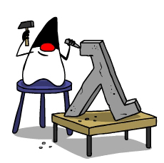

% Importancia de la Programación Funcional en Java
% Carlos Gómez
% 28 de Mayo del 2015

# 

Presentación preparada para el *Diplomado Actualización de Sistemas Version 4 (Postgrado-UDABOL)*,
materia *Lenguajes de programación* dictado por el Ing. Edson Terceros.

> Puedes ver la presentación online: [http://carliros.github.io/fpj/](http://carliros.github.io/fpj/)

> También puedes revisar los códigos usados en la presentación: [https://github.com/carliros/fpj](https://github.com/carliros/fpj)

# Propósito de la presentación

> No pretendo ser exhaustivo en explicar el porque la programación funcional
> es importante en Java, pero si, almenos, despertar interés en este estudio
> y sentar algunas bases para continuar con la investigación.

# Contenido de la presentación

#. Un poco de mi
#. Un poco de Haskell
#. Cosas lindas de Haskell
#. Programación funcional en Java
#. Proyecto Lambda y Java 8
#. Para continuar con la investigación

# Un poco de mi

- Lic. en Informática

- Trabajando en un proyecto usando Java

-------------------------

## Pero amante de Haskell

-------------------------

# Un poco de Haskell

Según [Wikipedia](http://en.wikipedia.org/wiki/Colleen_Haskell)

* Es actriz
* Es productora de televisión
* etc.

Y según yo

* Es linda
* Una ves que la conoces, es defícil hacerla a un lado

-------------------------

## En términos técnicos

> Haskell es un **Lenguaje** de **Programación Funcional** *puro*, con
> *evaluación perezosa* y de propósito general. Peyton Jones

-------------------------

## Haskell provee:

* funciones de alto orden
* semántica no estricta
* tipado polimórfico estático
* tipos de datos algebraicos definidos por el usuario
* listas por comprensión
* sistema modular
* sistema monadico I/O
* tipos de datos primitivos para listas, arrays, números, ...
* etc.

# Cosas lindas de Haskell

Veamos algunas cosas lindas de Haskell.

------------------------------

## Queremos convertir todas las letras de una cadena a mayusculas/minusculas

~~~~{.haskell}
aMayuscula :: [Char] -> [Char]
aMayuscula [] = []
aMayuscula (c:cs)
    = (toUpper c) : aMayuscula cs
~~~~

~~~~{.haskell}
aMinuscula :: [Char] -> [Char]
aMinuscula [] = []
aMinuscula (c: cs)
    = (toLower c) : aMinuscula cs
~~~~

---------------------

## Podemos abstraer la repetición

~~~~{.haskell}
mapeo1 :: (Char -> Char) -> [Char] -> [Char]
mapeo1 f [] = []
mapeo1 f (c:cs) = (f c) : mapeo1 f cs
~~~~~

Y nuestras nuevas funciones serian

~~~~{.haskell}
aMayuscula1 = mapeo1 toUpper "Carlos"
aMinuscula2 = mapeo1 toLower "Carlos"
~~~~

--------------------------

## Pero si ahora queremos convertir un listado de números a un listado descriptivo de pares (P) e impares (I)

~~~~{.haskell}
parImpar :: [Int] -> [Char]
parImpar [] = []
parImpar (n:ns)
    = if (even n) then 'P' : parImpar ns
                  else 'I' : parImpar ns
~~~~

------------------------

## Pero queremos reutilizar la función mapeo de repetición. Entonces, necesitamos parametrizar el tipo.

~~~~{.haskell}
mapeo :: (a -> b) -> [a] -> [b]
mapeo f [] = []
mapeo f (e:es) = (f e) : mapeo f es
~~~~

-----------------------

Nuestras funciones ahora se reescribirian así:

~~~~{.haskell}
aMayuscula2 = mapeo toUpper "Carlos"
aMiniscula2 = mapeo toLower "Carlos"

determinarTipoNumero :: Int -> Char
determinarTipoNumero n = if (even n) then 'P'
                                     else 'I'
parImpar2 = mapeo determinarTipoNumero [4,3,2,1]
~~~~

---------------------

## La función **map** de Haskell

> Lo *lindo* de **Haskel** es que la función **mapeo** es una función estandar de
> **Haskell**.  Es llamada "map" y abstrae la repetición y la parametrización
> del tipo.

~~~~{.haskell}
map :: (a -> b) -> [a] -> [b]
~~~~

Las ventajas son:

* Se abstrae la repetición
* Es más simple de usarlo
* Nos permite centrarnos en lo importante, la función que mapea de un valor a otro

--------------------------

## Un ejemplo no tan trivial como el de cadenas y números

Tenemos una lista de empleados:

~~~~{.haskell}
data Empleado
    = Empleado {nombre :: String, sueldo :: Float}
    deriving Show

listaEmpleados :: [Empleado]
listaEmpleados
    = [ Empleado "Pedro" 500
      , Empleado "Juan" 600
      , Empleado "Jacobo" 700]
~~~~

------------------------

## Queremos realizar el incremento del 8.5%

~~~~{.haskell}
incremento :: Float
incremento = 8.5

incrementarSueldo :: Empleado -> Empleado
incrementarSueldo empleado
  = empleado {sueldo = nuevoSueldo}
  where nuevoSueldo
    = let sueldo' = sueldo empleado
          inc     = (incremento / 100.0) * sueldo'
      in sueldo' + inc

aplicarIncremento
  = map incrementarSueldo listaEmpleados
~~~~

--------------------------------------

## La función **filter**

Al igual que la función **map** tenemos la función **filter** de Haskell.

~~~~{.haskell}
filter :: (a -> Bool) -> [a] -> [a]
~~~~

La función **filter** abstrae la

* Se abstrae la repetición
* Construye un nuevo listado basado en la función predicado

-----------------------------

## Filtrar empleados

Continuando con el ejemplo anterior, queremos filtrar los empleados que
ganaban más de 500.

~~~~{.haskell}
mayorA500 :: Empleado -> Bool
mayorA500 empleado = sueldo empleado > 500.0

aplicarFiltro = filter mayorA500 listaEmpleados
~~~~

--------------------------------------

## Funciones de combinación binaria

Otra de las funciones poderosas de Haskell son las funciones de combinación
binaria:

- **foldr**: combinación de un listado comenzando por la derecha (right)

    ~~~~{.haskell}
    foldr :: (a -> b -> b) -> b -> [a] -> b
    foldr f e [] = e
    foldr f e (x:xs) = f x (foldr f e xs)
    ~~~~

- **foldl**: combinación de un listado comenzando por la izquierda (left)

    ~~~~{.haskell}
    foldl :: (b -> a -> b) -> b -> [a] -> b
    foldl f e [] = e
    foldl f e (x:xs) = foldl f (f e x) xs
    ~~~~

-----------------------------

## Obtener el gasto de sueldos

Con el objetivo de usar la función **foldr** podemos hacer una función
que sume los sueldos de los empleados y asi obtener el gasto de sueldos.

~~~~{.haskell}
sumarSueldos :: Empleado -> Float -> Float
sumarSueldos (Empleado _ sueldo1) sueldo2
    = sueldo1 + sueldo2

gastoSueldos = foldr sumarSueldos 0.0 listaEmpleados
~~~~

-----------------------------

## Resumen del lado Haskell

Lo que hasta ahora se ha visto son 3 funciones principales:

* map
* filter
* foldr

Estas son funciones de alto orden: esto es funciones que trabajan con funciones.

Y algunos beneficios son:

* Se abstrae la repetición
* Nos permite centrarnos en lo que importa más

> ¿ Es posible hacer algo similar en Java ?

# Programación funcional en Java

> Específicamente: ¿Es posible usar funciones de alto orden en Java?

Si, es posible. Pero dependiendo de la version de Java, es más elegante y nativo
hacerlo en una que en otras.

-------------------

##

-----------------------------------

## Retomando nuestro ejemplo

Tenemos nuesto objeto *Empleado*:

~~~~{.java}
public class Empleado {
    private String nombre;
    private Float sueldo;

    //getters y setters
}
~~~~

---------------------

y tenemos nuestro listado de empleados:

~~~~{.java}
Empleado pedro = new Empleado();
pedro.setNombre("Pedro");
pedro.setSueldo((float) 500);

Empleado juan = new Empleado();
juan.setNombre("Juan");
juan.setSueldo((float) 600);

Empleado jacobo = new Empleado();
jacobo.setNombre("Jacobo");
jacobo.setSueldo((float) 700);

empleados = new ArrayList<Empleado>();
empleados.add(pedro);
empleados.add(juan);
empleados.add(jacobo);
~~~~

-----------------------

## Incrementar el sueldo -  version 1

~~~~{.java}
private Empleado incrementarSueldo(Empleado e){
    Float sueldo = e.getSueldo();
    Float incrementoSueldo
      = sueldo * (incremento / 100);

    e.setSueldo(sueldo + incrementoSueldo);

    return e;
}

public void incrementarSueldoEmpleados1(){
    for (Empleado e : empleados){
        incrementarSueldo(e);
    }
}
~~~~

-----------------------

## Abstrayendo la repetición

Nos creamos un utilitario que abstrae la repetición para listas, y que también
soporta tipos genericos:

~~~~{.java}
public <T, U> List<U> map(
  List<T> list, Map<T, U> function) {
    List<U> mapList = new ArrayList<U>();

    for (T t : list){
        U u = function.action(t);

        mapList.add(u);
    }

    return mapList;
}
~~~~

-----------------------

## ¿ Funciones de alto orden ?

El código $Map<T, U> function$ es una interface Java, y es utilizado para dar
soporte a funciones de alto orden en Java.  Estas interfaces pueden ser
instanciadas cuando son utilizadas por el desarrollador.

~~~~{.java}
public interface Map<T, U> {
    U action(T t);
}
~~~~

-----------------------

## Reescribiendo nuestro ejemplo

~~~~{.java}
public void incrementarSueldoEmpleados2(){
    empleados = ListUtils.getInstance().map(
      empleados, new Map<Empleado, Empleado>() {
        @Override
        public Empleado action(Empleado empleado) {
            return incrementarSueldo(empleado);
        }
    });
}
~~~~

---------------------

## La función **filter**

Siguiendo la misma idea que el **map**, definimos:

~~~~{.java}
public <T> List<T> filter(
  List<T> list, Filter<T> function){
    List<T> filterList = new ArrayList<T>();

    for (T t : list){
        if (function.action(t))
            filterList.add(t);
    }

    return filterList;
}
~~~~

-----------------------

## La interface **Filter**

~~~~{.java}
public interface Filter<T> {
    boolean action(T t);
}
~~~~

-------------------

## Aplicar filtro a los empleados

Filtrar los empleados con sueldo mayor a 500.

~~~~{.java}
public void mostrarEmpleadosConSueldoMayorA1(
  Float sueldoBase){

  List<Empleado> listaFiltrada
    = ListUtils.getInstance().filter(
        empleados, new Filter<Empleado>() {
          @Override
          public boolean action(Empleado empleado) {
            return empleado
                    .getSueldo()
                    .compareTo(sueldoBase) > 0;
          }
        });
}
~~~~

----------------------

## Recapitulando las cosas revisadas

Ventajas:

- Podemos pasar acciones a traves de las interfaces de Java.
- Se esta abstrayendo las repeticiones en un utilitario de funciones.

Desventajas:

- El código no es muy elegante y es dificil su lectura. **Proyecto Lambda de Java 8 al rescate!!**

-------------------

##

-------------------------

# Proyecto Lambda y Java 8

EL proyecto lambda da soporte tanto en librerias y sintaxis de Java para mejorar el 
manejo/uso de caracteristicas de programación funcional. Por ejemplo:

- Expresiones lambda
- Operaciones sobre listas (Stream, Iterators). Esto nos permite hacer uso de funciones como
  **map**, **filter**, **reduce**, generadores, etc.
- Un tipo de dato **Optional** (o tipo de dato **Maybe** de Haskell).
- otros.

-------------------------

## Reescribiendo los ejemplos anteriores

Incrementando el sueldo a los empleados usando solo **expresiones lambda**

~~~~{.java}
public void incrementarSueldoEmpleados3(){
  empleados = ListUtils.getInstance()
    .map(empleados, 
          empleado -> incrementarSueldo(empleado));
}
~~~~ 

-------------------------

## Reescribiendo los ejemplos anteriores

Incrementando el sueldo a los empleados usando **iteradores**

~~~~{.java}
public void incrementarSueldoEmpleados4(){
  empleados.forEach(this::incrementarSueldo);
}
~~~~

-------------------------

## Reescribiendo los ejemplos anteriores

Mostrar empleados con sueldo mayor a ... aplicar filtro

~~~~{.java}
public void mostrarEmpleadosConSueldoMayorA2(
 Float sueldoBase){
  List<Empleado> listaFiltrada 
    = ListUtils.getInstance().filter(empleados, 
        empleado -> empleado
                     .getSueldo()
                     .compareTo(sueldoBase) > 0);
  imprimirEmpleados3(listaFiltrada);
}
~~~~

-------------------------

## Reescribiendo los ejemplos anteriores

Mostrar el total de sueldos, operación binaria (fold)

~~~~{.java}
public Float calcularTotalSueldos(){
  Float sueldos 
    = empleados
       .stream()
       .map(empleado 
             -> empleado.getSueldo())
       .reduce((float) 0, 
          (sumatoria, sueldo) 
             -> sumatoria + sueldo);

  return sueldos;
}
~~~~

----------------------------

## Resumen del lado Java

- Es posible construir funciones de alto-orden en Java usando interfaces
- Usando funciones de alto-orden se abstrae las repeticiones, y permite
  centrarse en la función que procesa datos.
- Para version anteriores a Java 8, la sintaxis para construir funciones de
  alto-orden no es amigable. 
- Pero en Java 8, el proyecto Lambda provee muchas mejoras.

# Para continuar con la investigación

- Se puede revisar el paper [Why Functional Programming Matters](http://www.cse.chalmers.se/~rjmh/Papers/whyfp.html)
  que explica otros elementos importantes de la programación funcional.
- Se puede revisar [Scala](www.scala-lang.org/), un lenguaje de programación orientado a objetos y funcional.
- También se puede revisar la presentación de [Typeclassopedia de Scala](typeclassopedia.bitbucket.org)
  donde se intenta hacer una replica del [Typeclassopedia de Haskell](https://wiki.haskell.org/Typeclassopedia).
  Las funciones de map/fold son instancias de clases como Functor/Foldable y tienen un comportamiendo 
  diferente para otros tipos que no son listas en Haskell. 

------------------------------------

# Para continuar con la investigación

- Se puede seguir revisando como hacer sentencias de alto-orden.  Por ejemplo, en Haskell
  el if-the-else es una expresión, asi como lo es un función. Pero en Java se hace diferencia de una sentencia
  como el if-then-else, y la llamada a una función que vendria a ser una expresión.  Y las sentencias solo se pueden
  usar dentro de funciones o métodos. Hasta ahora se ha revisado
  que si es posible hacer funciones de alto-orden, pero **¿es posible hacer sentecias de alto-orden? ¿Se puede
  usar el if-then-else sin necesidad que este dentro de un método?**

------------------------------------

# Para continuar con la investigación

- Para dar soporte a expresiones lambda en versiones anteriores a Java 8 se puede revisar:

    - El proyecto [RetroLambda](https://github.com/orfjackal/retrolambda) 

    - El proyecto [FunctionalJava](http://www.functionaljava.org/)

# Llegamos al final

- Puedes ver la presentación online: [http://carliros.github.io/fpj/](http://carliros.github.io/fpj/)
- También puedes revisar los códigos usados en la presentación: [https://github.com/carliros/fpj](https://github.com/carliros/fpj)

<!--
pandoc -t dzslides --template template.html -s slide.md -o index.html
-->